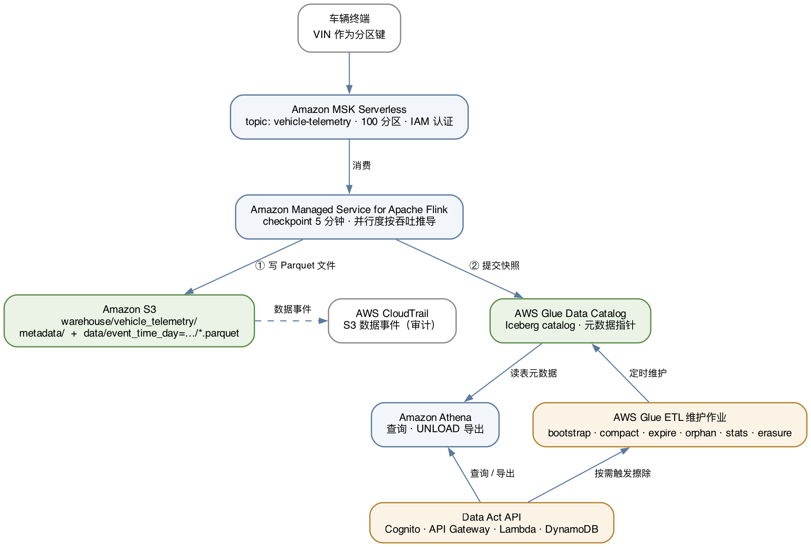

# 面向 EU Data Act 的车联网数据湖：用 Apache Iceberg 构建按 VIN 删除链路

一套可部署的参考实现：用 **Apache Iceberg** 在 **Amazon S3** 上构建车联网遥测数据湖，
并把 EU Data Act 与 GDPR 的四项数据主体权利落成具体的 API 端点与后台作业。

核心问题是一个结构性矛盾：监管要求能够按车辆唯一标识（Vehicle Identification Number，
VIN）删除单辆车的全部数据，而存储与查询效率要求不要为此把数据按 VIN 打散。本方案用
**时间分区 + Iceberg 行级删除** 同时满足两者，并为按 VIN 的删除与外围副本清理
提供可编排、可验证的基础。

> **`DELETE` 执行成功，并不等于数据已被擦除。** 这是本方案要解决的关键问题：
> Amazon Athena 的 `DELETE` 恒为 merge-on-read，只写标记文件而不重写数据；
> AWS Glue 侧用 `write.delete.mode=copy-on-write` 重写当前数据文件；历史快照、
> Flink 恢复状态、Kafka、导出对象和日志必须由独立删除编排继续处理。

---

## 架构



| 层 | 服务 | 职责 |
| --- | --- | --- |
| 消息 | Amazon MSK Serverless | 遥测消息缓冲，以 VIN 为分区键，IAM 认证 |
| 流处理 | Amazon Managed Service for Apache Flink | 消费 Kafka，转 Parquet 写入 Iceberg，checkpoint 与快照提交两阶段绑定 |
| 存储 | Amazon S3 | Iceberg 表数据与元数据，开放格式 |
| 目录 | AWS Glue Data Catalog | Iceberg catalog，用乐观并发协调多引擎写入 |
| 查询 | Amazon Athena | 即席查询与 `UNLOAD` 导出 |
| 维护与擦除 | AWS Glue ETL | 六个动作：`bootstrap` / `compact` / `expire` / `orphan` / `stats` / `erasure` |
| 权利 API | Amazon Cognito · Amazon API Gateway · AWS Lambda · Amazon DynamoDB | 认证、授权关系、七个端点 |

## 四项能力与对应义务

| 技术能力 | 对应义务 | 关键机制 |
| --- | --- | --- |
| 按车辆精准读取 | Data Act Art. 4；GDPR Art. 15 | 时间分区剪枝 + sort compaction 收紧 `vin` 列统计 + 扫描字节验证 |
| 完整导出 | GDPR Art. 20 | Athena `UNLOAD` + 预签名 URL；参数化查询避免注入面 |
| 精准共享 | Data Act Art. 5、Art. 6 | `role` 区分车主与第三方 + `allowed_signals` 行级过滤 + `expires_at` 到期 |
| 删除链路 | GDPR Art. 17 | copy-on-write 当前表删除 + 协调后的快照与外围副本清理 |
| 可追溯 | GDPR Art. 30 | AWS CloudTrail 数据事件 + Iceberg `$snapshots` 历史 |

> 本仓库讨论技术实现，**不构成法律意见**。条款的适用范围、豁免情形与合规判定请咨询
> 专业法律顾问。本方案主张的是「提供按 VIN 定位、重写和编排清理的技术基础」，
> 而不是「使你合规」。

---

## 快速开始

### 前提条件

- 一个 AWS 账户，具备创建 Amazon VPC、Amazon MSK、AWS Glue、AWS Lambda 与 IAM 资源的权限
- **Node.js 20+**、**AWS CLI v2**、**Docker**（Flink fat jar 与 Lambda 依赖都在容器内构建，
  无需本地安装 JDK / Maven / Python 依赖）
- 部署区域需符合你的数据驻留要求。默认 `eu-central-1`

### 部署

```bash
cd deploy
./deploy.sh
```

换环境或区域：

```bash
IOV_ENV=prod IOV_REGION=eu-west-1 ./deploy.sh
```

> 区域参数刻意**不继承** `CDK_DEFAULT_REGION`。默认继承很方便，但一旦本地配置指向
> 欧盟以外的区域，就会把欧盟个人数据部署到域外。要换区域必须显式写出来。

`deploy.sh` 在创建资源之前会依次执行六道门禁，任一项失败即中止：工具链与凭证检查、
TypeScript 编译、API 授权与输入校验测试、资产构建、Flink fat jar 内容校验、
Amazon MSK 客户端契约测试。

创建 MSK Serverless 集群、Iceberg 建表、Flink 启动到 `RUNNING` 合计约 **15–25 分钟**。

### 验证

```bash
# 端到端数据链路：灌模拟数据 -> 等 checkpoint -> Athena 校验
./validate.sh

# Data Act API 调用链与授权边界（22 项断言）
IOV_ENABLE_ADMIN_AUTH=1 ./deploy.sh          # 启用 ADMIN_USER_PASSWORD_AUTH
IOV_TEST_PASSWORD='<你自己的强口令>' ./validate-api.sh
```

> ⚠️ `validate-api.sh` 会真实触发一次按 VIN 的 copy-on-write 删除，被选中车辆会
> 从当前表状态中消失；历史快照仍需单独协调清理。仅在验证环境运行。

**数据可见延迟等于 checkpoint 间隔（默认 5 分钟）。** Iceberg 只在 checkpoint 提交时
才产生新快照，刚部署完立刻查表得到 0 行是正常的，不是故障。

### 清理

```bash
./destroy.sh
```

含个人数据的资源（warehouse 桶、审计桶、DynamoDB 授权表、Cognito 用户池）的
`RemovalPolicy` 为 `RETAIN`，需人工二次确认后删除。

> **成本提醒**：Amazon MSK Serverless 有按集群小时计费的基础费用，NAT 网关同样按小时
> 计费，两者都与数据量无关。验证完毕若暂不使用请及时清理。

---

## 仓库结构

```
deploy/                        AWS CDK 工程（TypeScript）
├── bin/app.ts                 CDK 入口
├── config/default.ts          集中配置：改规模只动这一处
├── lib/constructs/            network · storage · streaming · flink
│                              lakehouse · data-api · audit
├── assets/
│   ├── flink/                 Flink 作业（Java + pipeline.sql）
│   ├── glue/                  iceberg_maintenance.py：六个维护动作
│   └── lambda/
│       ├── data_api/          七个权利端点的实现
│       ├── kafka_tools/       主题创建与模拟数据生产者
│       ├── flink_app_control/ 自定义资源：启停 Flink 应用
│       └── glue_job_runner/   自定义资源：同步执行 Glue 作业
├── tests/test_data_api.py     授权与输入校验测试（部署门禁）
├── deploy.sh / validate.sh / validate-api.sh / destroy.sh
└── README.md                  详细实现说明与排错记录

ARCHITECTURE.md                架构设计说明：组件职责、实施步骤、9 处「⚠️ 实测」改法
docs/architecture.{dot,svg,png} 架构图（Graphviz 源文件 + 产物）
scripts/preflight-public.sh    公开发布前自检：凭证、真实标识符、合成数据、必备文件
```

`ARCHITECTURE.md` 是架构设计说明，`deploy/README.md` 是更详细的实现文档 —— 两者都包含
真实环境中遇到的失败与改法（标注为 **⚠️ 实测**），是本仓库里最值得先读的部分。

---

## 安全说明

本方案处理的是个人数据，以下几点是设计上的取舍，修改前请了解其影响：

- **VIN 不以明文进入日志。** `mask_vin()` 只保留后四位；SQL 文本在写日志前经 `redact()`
  脱敏。Amazon CloudWatch Logs 会保留数月，明文 VIN 一旦写入等于把个人数据复制到第二处存储。
- **warehouse 桶不启用版本控制。** copy-on-write 重写后，若桶启用版本控制，
  旧数据会以非当前版本继续保留并扩大删除范围。审计桶的要求相反，需要防篡改，因此启用版本控制。
- **不要对 Iceberg 数据启用 Amazon S3 归档存储层。** 归档对象需先 `RestoreObject` 才能读取，
  而按 VIN 的当前表删除必须能重写这些文件。
- **示例数据全部为合成数据。** VIN 使用刻意非厂商的前缀 `SAMPLEVEH0`，邮箱使用
  `@example.com`（RFC 2606 保留域）。
- **不要提交运行产物。** `.gitignore` 排除了 `*.log`、`cdk-outputs-*.json` 与
  `cdk.context.json` —— 它们含真实账号 ID、ARN、Amazon Cognito 用户池 ID 与 API 端点。
  Fork 后若要公开发布你自己的改动，先跑一遍 `./scripts/preflight-public.sh`。

发现安全问题请通过 [AWS 漏洞报告页面](http://aws.amazon.com/security/vulnerability-reporting/)
告知，**不要**创建公开 issue。

---

## 相关阅读

- [Apache Iceberg 文档](https://iceberg.apache.org/docs/latest/)
- [在 Amazon Athena 中查询 Apache Iceberg 表](https://docs.aws.amazon.com/athena/latest/ug/querying-iceberg.html)
- [Update Iceberg table data](https://docs.aws.amazon.com/athena/latest/ug/querying-iceberg-updating-iceberg-table-data.html)（Athena 的 `DELETE` 为何恒为 merge-on-read）
- [Amazon Managed Service for Apache Flink 开发者指南](https://docs.aws.amazon.com/managed-flink/latest/java/what-is.html)
- [在 AWS Glue 中使用 Apache Iceberg](https://docs.aws.amazon.com/glue/latest/dg/aws-glue-programming-etl-datalake-native-frameworks.html)

## 贡献

见 [CONTRIBUTING.md](CONTRIBUTING.md)。

## 许可

本项目采用 MIT-0 许可，见 [LICENSE](LICENSE)。
